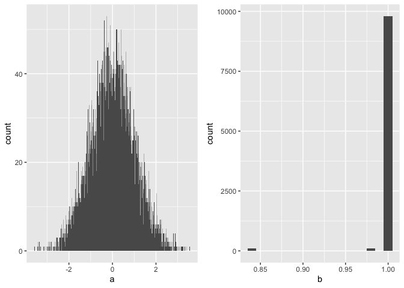

# How I use Git with my projects

This README details how to use variables in `R` and `bash` so that you
can use relative file paths i.e. `relative/file/path` as opposed to
`/path/to/my/relative/file/path`. This means when sharing code it should
be more reproducible by others as they will be using the same file paths
as you.

## Making a project directory

All of my projects use the same starting structure (here our project is
caled `project_1`):

    ##                 levelName
    ## 1  project_1/            
    ## 2   ¦--docs/             
    ## 3   ¦--manuscript/       
    ## 4   ¦--data/             
    ## 5   ¦--analysis/         
    ## 6   ¦--scripts/          
    ## 7   ¦--environment/      
    ## 8   ¦   °--environment.sh
    ## 9   ¦--.Renvironment     
    ## 10  ¦--.Rproj.user       
    ## 11  ¦--project_1.Rproj   
    ## 12  ¦--.git/             
    ## 13  ¦--.gitignore        
    ## 14  °--README.Rmd

To make this structure I use a standard script which first creates the
project directory and sub-directories. It then makes two environment
files which we use to pull our global file paths into our analysis
scripts with. It also makes a `.gitignore` file for our project and then
initializes the git repository.

<details>

<summary>Script</summary>

<p>

``` r
cd "path/to//001_projects"

projectname=$"project_1"


echo "Making new project called $projectname in:"
pwd

#script to set up new project on laptop and new git repo that is linked to github
mkdir $projectname
cd $projectname

mkdir docs
mkdir manuscript
mkdir data
mkdir analysis
mkdir scripts
mkdir environment

# make environment for sourcing file paths in bash and R
cd ../
echo "LOCLA='$PWD'" > $projectname/environment/environment.sh
echo "LOCAL='$PWD'" > $projectname/.Renvironment
cd $projectname

(
## general list of file extensions that could contain data

# common data file formats
echo *.csv
echo *.tsv
echo *.dta
echo *.txt
echo *.dat
echo *.[rR]data
echo *.[rR]data
# R file formats
echo .Rproj.user
echo .Rhistory
echo .RData
echo .Ruserdata
echo *.Rproj
echo *.Rmd

# genetic data file formats
echo *.bgen
echo *.gen

# files generated from BlueCrystal jobs
echo out*
echo error*
echo j*.sh.e*
echo j*.sh.o*
echo *.sh.e*
echo *.sh.o*

# UK Biobank data file formats
echo *.enc_ukb
echo *.enc
echo *.cwa

# common directories
echo manuscript
echo data
echo analysis
echo environment
echo run_scripts
echo output

# config file
echo config_$projectname

) > .gitignore


# STOP - before you do this bit make sure you have set up a repo of the same project name on GitHub
touch README.Rmd
touch config_$projectname
git init
git commit -m "first commit"
git remote add origin https://github.com/mattlee821/$projectname.git
git push -u origin master

echo "Finished"
```

</p>

</details>

<br> I then make a new RStudio project and assign it to this existing
directory by selecting `File > New Project > Existing Directory >
Browse` and then selecting the recently made project directory.

### Environment

This project directoy is set up with two files: `.Renvironment` and
`environment/environment.sh`. Both files have the exact same content a
line of code that reads `001_projects='/path/to/001_projects`. This
allows us to source this environment variable in our scripts so we can
use relative file paths.

#### Example: `R`

I want to make a plot using some data stored in a text file in my
`data/` directory. First we need to tell R what are working directory
is, but we dont want to use a full file path. So we can grab the full
file path from the `.Renviron` file we made with our set-up script using
`Sys.getenv("LOCLA")` where `LOCAL` is the variable name we assigned
that file path. Then we can set our working directory as `LOCAL`
i.e. `/path/to/001_projects` and make some data and save it to `data/`:

``` r
# set environment
LOCAL <- Sys.getenv("LOCAL")
setwd(LOCAL)

# make text file of some data and save it in data/
data <- data.frame(a = rnorm(rep(1:100, 100)),
                   b = pnorm(rep(1:100, 100)))
write.table(data, "how_to_git/data/data_frame.txt", 
            row.names = FALSE, col.names = TRUE, quote = FALSE, sep = "\t")
```

Now we can access that data in a seperate script using the same process
of retrieving the variable we want to use to set our working directory:

``` r
# set environment
LOCAL <- Sys.getenv("LOCAL")
setwd(LOCAL)

# load data
data <- read.table("how_to_git/data/data_frame.txt", header = T, sep = "\t")

# plot data
library(ggplot2)
a <- ggplot(data = data,
       aes(a)) + 
  geom_histogram(binwidth = 0.01, alpha = 1)

b <- ggplot(data = data,
       aes(b)) + 
  geom_histogram(binwidth = 0.01, alpha = 1)

library(cowplot)
plot_grid(a,b)
```

<!-- -->

#### Example: `bash`

Lets say we want to make a file using `bash` in Terminal. We can’t
access the `LOCAL` variable in our `.Renviron` folder using `bash`.
Instead we have to access it through a text file. In this case we’ve
made this text file available in our `environment/` directory as
`environment.sh`.

``` bash
# set environment
source environment/environment.sh

# set working directory
cd "$LOCAL/how_to_git"

# make folder
echo "We made this file to show how to use environment variables in bash" > "$LOCAL/how_to_git/bash_file.test"

# show directory files
head "$LOCAL/how_to_git/bash_file.test"
```

    ## We made this file to show how to use environment variables in bash

You can see that heading the file shows that it has been made in the
right location.
